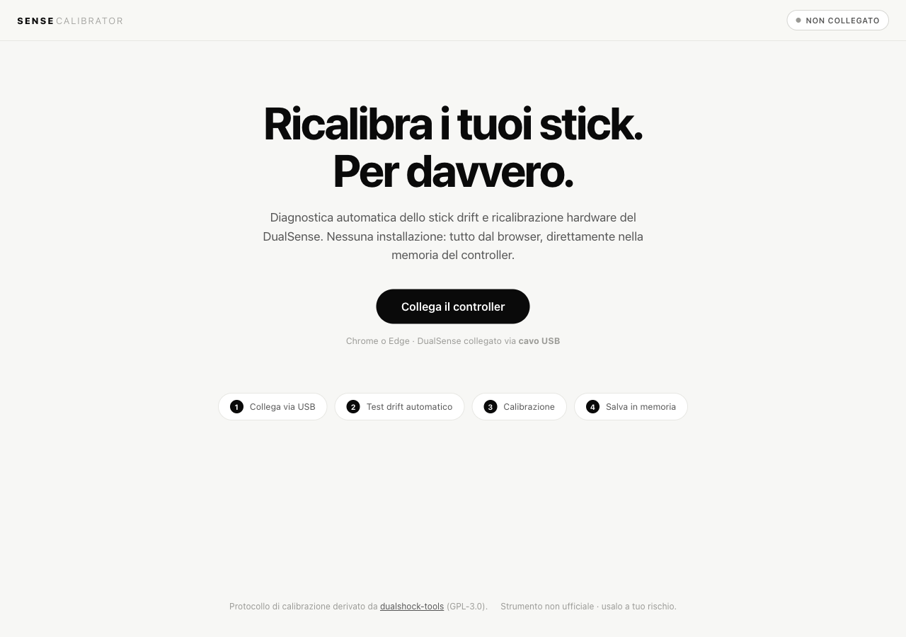

# How the New SOTA Model [Fable 5](https://www.anthropic.com/claude/fable) Saved Me $60 in 30 Minutes

*Fixing my PS5 DualSense stick drift for good, with a browser tool I built instead of buying a new controller.*

My DualSense developed stick drift, and the right stick was the giveaway. I play FC 26, and out of nowhere my players started pulling off skill moves I never asked for, wrecking the flow of every match. The right stick is what triggers skills, and it was reporting a small constant offset at rest, so the game read that phantom tilt as a deliberate flick. I tried the usual software fixes everyone recommends. None of them actually solved it for me. So I did the thing an 18-year-old developer with a Claude Max subscription does: I used [Fable 5](https://www.anthropic.com/claude/fable), Anthropic's new state-of-the-art model, to build my own tool. It is called Sense Calibrator, it runs entirely in a browser, and it writes a permanent fix directly into the controller.

This is how it came together, how it works, and why the result is actually better than anything I tried first.

## Why the usual fixes did not work

The mainstream advice for DualSense drift falls into one bucket: increase the deadzone somewhere. DS4Windows lets you remap the controller as an XInput pad and widen the inner deadzone radius. reWASD does the same thing for about six dollars. Steam Input has per-game deadzone sliders. The PS5 itself has an "Adjust Input Threshold for Joysticks" setting buried in Accessories.

They all share one architectural flaw: they mask the drift on one machine, they do not fix it. The controller still drifts. The host OS or the game just throws away the bad values before they reach gameplay. The moment I unplugged from that specific PC, or launched a game outside Steam, or picked the controller back up on the actual PS5, the drift came back exactly as before. The configuration lives on the host, not on the controller, so it does not travel.

That is the part nobody explains clearly. You think you fixed it, you did not, you just moved where you were not looking.

What I actually wanted was to change the controller, not babysit a deadzone profile on every device I own.

## The thing Sony does not ship

DualSense controllers store factory calibration data in non-volatile storage (NVS) on the controller itself. The production line calibrates each stick and writes the result there. That data is what the controller carries everywhere, on PS5, on PC, on Mac, on anything.

Sony has never shipped a consumer tool to rewrite it. The PS5 menu gives you a drift test and a deadzone slider, and that is the entire official toolbox. There is no factory recalibration option anywhere in the system.

The open-source community reverse-engineered the calibration command sequence years ago. The reference implementation is [dualshock-tools](https://github.com/dualshock-tools/dualshock-tools.github.io), an MIT-licensed project that talks to the controller over WebHID and issues the same calibration commands the factory uses. It works, the protocol is correct, and it genuinely writes a permanent fix. My calibration protocol derives directly from it, so Sense Calibrator keeps the original MIT license and credits its author, the_al.

So why build a second tool? Because dualshock-tools drops a non-technical user onto a dashboard of raw controls with no guided flow. The single most common failure in community threads is Bluetooth-versus-USB confusion: WebHID needs a wired connection, most people pair wirelessly by default, and the tool does not stop them or explain it in a way they understand. People also see an "NVS status: 0x03030201" readout and a manual command console, get intimidated, and give up. The protocol was solved. The experience was not. I wanted something my own non-technical self could hand to anyone.

## What I had [Fable 5](https://www.anthropic.com/claude/fable) build

I built the whole tool with Anthropic's [Fable 5](https://www.anthropic.com/claude/fable) model. What surprised me was the actual calibration and diagnostic logic. It is more thoughtful than I expected going in. A few pieces are worth walking through.

### Drift detection by stability, not by offset

The naive way to detect drift is to read the stick at rest and check if the value is non-zero. That breaks the instant a finger brushes the stick or the controller vibrates on the table.

Instead, the drift test runs for three seconds, samples input report `0x01` at roughly 250 Hz, and discards the first 60 samples for settling. For every sample it looks at the spread (max minus min) across the last 30 samples on all four axes. If that spread exceeds a movement threshold, the sample is classified as movement and thrown out. What survives is signal that is genuinely stable. This is the key trick: a stick with a large fixed drift offset still looks perfectly stable over a window, while a hand resting on the stick looks noisy. Stability separates real drift from interference, where a raw offset reading cannot.

The drift estimate itself is the median per axis, not the mean, so one vibration spike does not skew it. Noise is reported separately as the 95th percentile of per-sample distance from center, which is how the tool flags a worn potentiometer (continuous jitter) versus a clean offset (a stable wrong center). If too few samples survive the stability filter, the test retries up to twice before giving up and labeling the result unstable rather than throwing an error.

### Quick calibration that converges on itself

The quick calibration is not a single shot. It runs up to three passes. Each pass opens a calibration session, sends eight center samples to the controller's RAM, commits, then re-measures the residual offset using the same stability filter as the drift test. If the residual is already under threshold, it stops early. If not, it runs again. It self-corrects toward a good center instead of trusting one attempt.

### A guided wizard with live aim

For stubborn drift there is a four-corner guided calibration. The tool walks you through pushing both sticks into each of the four corners in turn, sampling at each one, then commits the multi-point center estimate. While you do it, two live mini-dials show the actual stick position against a dashed target ring, so you can see whether the stick is really reaching the corner even when the existing calibration is off. (To the user it is four corners. Internally it is a six-phase state machine counting intro and done.)

### Range calibration with a polar coverage map

Range calibration tracks per-axis minimum and maximum while you rotate both sticks around their full perimeter. To make sure you actually cover the whole circle and not just the cardinal directions, coverage is drawn as a 36-bin polar histogram, one bin per ten-degree sector, each holding the furthest radius reached there. The save button only unlocks once coverage crosses an adaptive threshold across every sector, with a 15-second timeout as a fallback.

### The permanent write, with a safety net built in

Here is the part that makes it a real fix instead of a mask. Calibration commands write to the controller's RAM first, managed via feature reports `0x82` and `0x83`. The stick visualization reflects the new center immediately, so you can confirm it worked before committing anything. To make it permanent you explicitly click "write to memory", which runs an unlock then lock cycle on the controller's NVS, managed via reports `0x80` and `0x81`. (Those same reports also serve device-info, serial, and reboot queries, so they are not NVS-dedicated, just the channel NVS happens to use.)

The safety net is simple by design: everything you do lives in RAM until that final lock. Powering the controller off at any point before you write reverts it completely to the factory calibration. A persistent banner reminds you the active calibration is temporary until written, and the page warns you on close if you have unsaved state. You genuinely cannot brick the calibration by experimenting, which made me far more willing to actually use the thing.

### A precision mini-game to prove it worked

Calibration is worthless if you cannot tell whether it helped. So there is an optional 60-second precision test that produces a reproducible 0 to 100 score, meant to be run before and after. It never sends any HID commands, it only reads stick position. Three trials: Fermezza measures how still the stick sits when untouched, Bersagli scores how fast and cleanly both sticks hit seven fixed targets, and Inseguimento has both sticks trace a Lissajous curve while measuring tracking error. The scoring is deterministic, so the same performance always yields the same number, and the previous score is stored and shown as a delta. I ran it before and after on my own controller and watched the number climb, which is a much more satisfying confirmation than "feels better now I guess".

> _[screenshot placeholder: drift test result, two stick dials with the offset and verdict, capture with a real DualSense connected]_

> _[screenshot placeholder: quick calibration in progress, capture with a real DualSense connected]_

> _[screenshot placeholder: range calibration coverage, the 36-bin polar coverage dials, capture with a real DualSense connected]_

> _[screenshot placeholder: precision mini-game mid-trial, capture with a real DualSense connected]_

> _[screenshot placeholder: NVS write confirmation dialog, capture with a real DualSense connected]_

## The economics

This is the part I find quietly satisfying. I built the entire thing on the single Claude Max plan I already pay 200 USD a month for, and it came together in about half an hour of back and forth. According to my recorded usage, it took roughly 30 percent of the 5-hour rolling limit and under 10 percent of the weekly limit, all at medium reasoning effort. ([Fable 5](https://www.anthropic.com/claude/fable) is documented in its [system card](https://anthropic.com/claude-fable-5-mythos-5-system-card) if you want the model details.)

So the real cost was a few dollars of usage out of a budget I had already spent, against a new standard DualSense, which runs about 60 to 75 dollars (75 euros at EU list price, often near 55 on sale). And a new controller is a worse deal than it looks: it fixes one controller, once, until that one drifts too. What I got instead was a permanent cross-platform fix on the controller I already own, plus a reusable open-source tool I can point anyone at the next time a stick goes bad.

## How it compares

| Solution | Permanent fix? | Works on every platform after? | Cost |
|---|---|---|---|
| **Sense Calibrator** | Yes, writes to controller NVS | Yes, the fix travels with the controller | Free |
| **dualshock-tools** | Yes, same NVS protocol | Yes | Free |
| **DS4Windows** | No, PC driver mask | No, PC only | Free |
| **reWASD** | No, PC driver mask | No, PC only | Paid (~6 USD) |
| **Steam Input** | No, per-game mask | No, Steam on that PC only | Free |
| **Sony PS5 settings** | No, deadzone only | No, PS5 only | Free |
| **Contact cleaner spray** | Sometimes, not for wear | Yes | ~5-10 EUR |
| **Potentiometer replacement** | Yes | Yes | ~5 EUR parts, or ~35-40 EUR pro repair |
| **New DualSense** | Yes, starts fresh | Yes | ~55-75 EUR |

The split is between the tools that write to the controller (dualshock-tools and Sense Calibrator) and everything in the driver-layer column. The driver tools reduce what you feel on one machine and leave the controller untouched. The hardware routes work but want soldering or a teardown, or they just cost more than the software fix and only buy you a fresh controller that can drift again.

## The honest limits

I am not going to oversell this. It is a reverse-engineered protocol, not sanctioned by Sony, and you use it at your own risk (the RAM safety net is real, but the disclaimer stands). It supports the standard DualSense only. The DualSense Edge has a different calibration subsystem and the DualShock 4 has a different NVS layout, so neither is supported. It needs Chrome or Edge over a wired USB connection, because Safari has no WebHID at all and Bluetooth is blocked by design. And the most important caveat: calibration corrects offset drift, where the sensor reports a non-zero value at rest. It cannot repair mechanical wear. If the potentiometer wiper is physically degraded, calibrating around the noise floor may buy you time, but the hardware is still failing and eventually you will need a new stick.

For my controller, the drift was offset, not wear, and the fix has held. That is the case this tool is built for, and it is a common one.

## Try it

The whole thing is a static page. No install, no driver, no account. Plug a DualSense into a USB port, open the page in Chrome or Edge, and the drift test runs on its own.

Source and instructions are on GitHub: **github.com/martino-vigiani/sense-calibrator**. It is MIT-licensed, building on the work of the dualshock-tools project that made the protocol public in the first place. If your stick drifts and you were about to buy a new controller, try this first.
