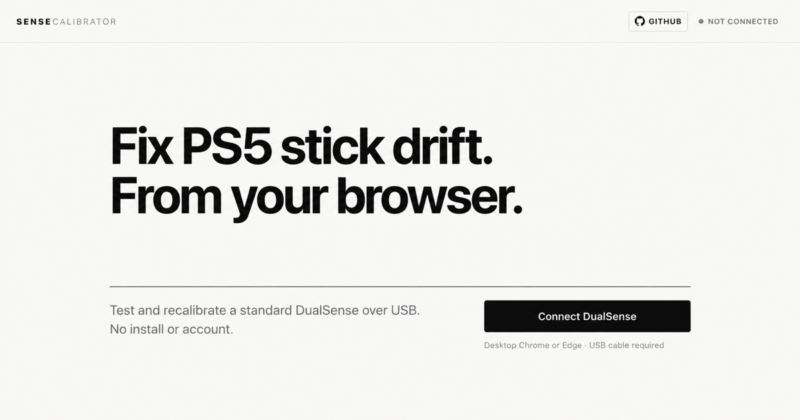

# Sense Calibrator

Test and recalibrate stick drift on a standard PS5 DualSense, directly from desktop Chrome or Edge.

**[Open Sense Calibrator](https://martino-vigiani.github.io/sense-calibrator/)**

You need a desktop computer, a USB data cable and a standard DualSense (`054C:0CE6`). DualSense Edge and DualShock 4 are not supported.

[](https://github.com/martino-vigiani/sense-calibrator/stargazers)  



> Calibration can correct a stored center or range offset. It cannot repair a worn, dirty or damaged stick module.

## Use it

1. Connect the controller to your computer with a USB data cable.
2. Open the [hosted tool](https://martino-vigiani.github.io/sense-calibrator/) in Chrome or Edge.
3. Select **Connect DualSense** and approve the browser request.
4. Put the controller on a stable surface and leave both sticks untouched while the drift test runs.
5. Calibrate only if the result shows a correctable offset.
6. Run the drift and precision tests again to compare the result.
7. Select **Write to memory** only when you want to keep the calibration.

Calibration is applied to controller RAM first. If you turn the controller off before **Write to memory**, the temporary calibration is discarded.

## What it does

| Tool | What it tells you | Changes the controller? |
|---|---|---|
| **Drift test** | Resting offset and signal noise for each stick | No |
| **Quick calibration** | Automatically corrects a stable center offset | Temporary until saved |
| **Guided calibration** | Recalibrates the center with a four-corner procedure | Temporary until saved |
| **Range calibration** | Recalibrates the full travel of both sticks | Temporary until saved |
| **Precision test** | Compares center hold, edge reach and snap back before and after | No |

The public tool stays focused on testing and calibration. Sensitivity Finder and Gameplay Lab are experimental and remain hidden behind the local preview mode while they are developed and tested.

## Why calibration can help

A DualSense stores calibration values that describe where each stick rests and how far it can travel. Those values can become inaccurate even when the stick module still produces a stable signal.

Sense Calibrator measures the untouched sticks first. A stable offset can often be corrected by writing a new center or range calibration. A noisy or unstable signal usually points to dirt, wear or mechanical damage, which software cannot repair.

The app applies calibration temporarily, runs the same measurements again and lets you decide whether to save it. For the protocol details, read [ARTICLE.md](ARTICLE.md) or the [SubraLabs technical write-up](https://subralabs.com/lab/sense-calibrator.html).

## Limits and safety

- Only the standard DualSense with USB product ID `054C:0CE6` is supported.
- Calibration works only over USB. Bluetooth is rejected for calibration.
- Chrome and Edge are supported because they provide WebHID. Safari and Firefox do not.
- Calibration can correct stored center and range values. It cannot repair physical wear.
- This is an unofficial tool and is not affiliated with Sony.

Do not disconnect the controller during calibration. Review the before and after result before writing anything to controller memory.

## Telemetry & privacy

The tool has no account, ads or third-party analytics.

Calibration events are kept in your browser under `sense-calib-sessions`, with a limit of 200 entries. This local history is stored whether network sharing is enabled or not.

Nothing is uploaded until you choose **Keep sharing** in the first-launch notice. The current server contract accepts only a complete Quick calibration: timestamp, board revision, firmware version, before and after offset and noise, pass measurements, and stability settings. Other events stay in the browser.

The upload excludes the controller serial number, device identifiers and the local session ID. Like any web request, the server can receive network metadata such as an IP address for routing and rate limiting, but it is not stored in the telemetry record. Select **Don't share** to discard queued uploads and save that preference.

## Run it locally

Clone or download the repository, then start a local server:

```sh
python3 -m http.server 8000
```

Open `http://localhost:8000` in Chrome or Edge. Opening `index.html` through `file://` does not work because WebHID requires a secure context.

There is no build step and there are no runtime dependencies. Run the automated checks with:

```sh
npm test
```

The automated suite checks the telemetry contract and keeps experimental tools out of the public search surface. It does not prove controller behavior. Calibration changes still require a real DualSense connected over USB.

For local work on the experimental tools, add `?preview=1` to the URL.

## Contribute

Useful contributions include:

- controller results with measurements before and after calibration;
- reproducible bug reports;
- tests for WebHID and calibration failure paths;
- accessibility, documentation and browser compatibility fixes.

Start with [CONTRIBUTING.md](CONTRIBUTING.md). Never include a controller serial number or another device identifier in an issue, screenshot or test fixture.

## License and credits

Sense Calibrator is available under the [MIT License](LICENSE).

The calibration protocol derives from the MIT licensed [dualshock-tools](https://github.com/dualshock-tools/dualshock-tools.github.io) project by the_al. Its original license is preserved in [THIRD_PARTY_NOTICES.md](THIRD_PARTY_NOTICES.md).
