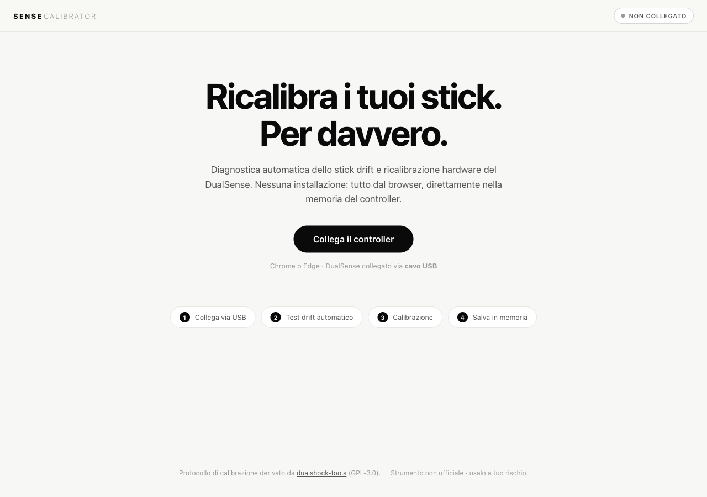

# Sense Calibrator

Your PS5 controller is drifting. A €2 potentiometer is miscalibrated. You don't need a new controller — **fix it from your browser in 2 minutes, nothing to install.**

Sense Calibrator diagnoses analog stick drift and writes a permanent hardware recalibration directly into the DualSense's non-volatile memory, over WebHID. The fix travels with the controller to every platform — PS5, PC, Mac.

  



<!-- TODO: demo GIF -->

> 📖 **The story behind this tool:** how I fixed my controller's stick drift by building this with Anthropic's Fable 5 model, instead of buying a new one — [**read ARTICLE.md**](ARTICLE.md).

---

## Quick start

Requirements: **Chrome or Edge** (Safari/Firefox have no WebHID), **USB cable** (Bluetooth is detected and rejected), a standard DualSense (`054C:0CE6`).

1. Clone or download this repo, then start a local HTTP server (WebHID requires a secure context — `file://` does not work):

   ```sh
   python3 -m http.server 8000
   ```

2. Open `http://localhost:8000` in Chrome or Edge.
3. Connect your DualSense with a **USB cable**.
4. Click **Connect controller** — the drift test runs automatically.
5. Calibrate if needed. When satisfied, click **Write to memory** to make the fix permanent.

> Calibration lives in RAM until you click **Write to memory**. Powering the controller off before that reverts everything — use this as a free safety net to experiment first.

---

## What it does

- **Automatic drift test on connect** — measures stick resting offsets, classifies drift (centered / mild / marked), and distinguishes a clean offset from potentiometer wear using signal-noise analysis.
- **Quick calibration** — re-centers the sticks automatically. Samples are stability-gated (touch or vibration never contaminates the average), the gate adapts to the controller's own noise floor, and passes repeat until the residual offset converges. The final verdict distinguishes a fixable offset from worn hardware that needs physical repair.
- **Guided four-corner calibration** — for stubborn drift: push sticks into each corner while live dials show actual vs. target position.
- **Range calibration** — rotate both sticks to recalibrate full travel; a 36-bin polar coverage map unlocks the save button only once the full perimeter is covered.
- **Precision mini-game** — optional scored test (steadiness, fixed targets, Lissajous tracking) producing a reproducible 0–100 score per stick, so you can prove the fix worked before and after.
- **Permanent NVS write** — calibration is temporary until you explicitly write it to the controller's non-volatile storage. Once written, the fix applies everywhere.
- Live stick visualization, HID command log, automatic reconnect.

---

## How it works

*Skimmable for the technically curious.*

**Protocol layer (`js/ds5.js`)** talks to the controller via WebHID feature reports:

| Report | Purpose |
|---|---|
| `0x82` / `0x83` | Send calibration data / read back response |
| `0x80` / `0x81` | NVS management: unlock → write → lock cycle; also device info, serial, reboot |
| `0x01` (input) | Raw stick values, sampled at ~250 Hz for drift detection |

**Drift detection** samples input report `0x01` for 3 seconds, discards the first 60 samples for settling, and classifies each subsequent sample as movement or stable using the spread (max − min) across a 30-sample rolling window on all four axes. Only stable samples feed the drift estimate. The estimate is the per-axis median (outlier-resistant); noise is the 95th-percentile distance from center (flags worn potentiometers). If too few stable samples accumulate, the test retries up to twice before reporting an unstable result.

**Quick calibration** runs up to 4 convergence passes. Each pass opens a calibration session, sends 12 center samples via `0x82`, commits, then re-measures residual offset with the same stability filter. It stops early if the residual falls below threshold; otherwise it passes again. The stability gate is adaptive — it widens to accommodate inherently noisy sticks so a jittery worn stick still calibrates.

**NVS write** is an explicit unlock → lock cycle via `0x80`/`0x81`. Everything before that lives only in controller RAM; power-off is a free revert.

---

## Limitations

- Standard DualSense only (`054C:0CE6`). **DualSense Edge and DualShock 4 are not supported.**
- USB only. **Bluetooth calibration is not supported** (WebHID blocks it by design).
- Chrome or Edge only. Safari and Firefox have no WebHID.
- Calibration corrects offset drift (a stable non-zero resting value). It cannot repair mechanical wear — if the potentiometer wiper is physically degraded, you may need a hardware fix eventually.
- No live deployment yet — run it locally with the quick-start steps above.

---

## Telemetry & privacy

Sense Calibrator can optionally upload anonymous calibration data to a self-hosted endpoint to help improve the algorithm over time. This is **opt-in and off by default**.

**What is sent** (when you enable it):

| Field | Description |
|---|---|
| `t` | ISO 8601 timestamp of the session |
| `board` | Controller board model (e.g. `BDM-030`) |
| `fw` | Firmware version integer |
| `before` | Stick offsets and noise before calibration |
| `passes` | Residual offset after each calibration pass |
| `after` | Stick offsets and noise after calibration |
| `unstableEvents` | Number of times the stability gate widened or was bypassed |
| `gate` | Final stability-gate spread value used |
| `gateOff` | Whether gating was disabled entirely |

**What is never collected:** serial number, any device identifier, IP address (not stored server-side), browser fingerprint, or any personal information.

**Where it goes:** a self-hosted server at `subralabs.com`. No third-party analytics services are used.

**Local copy:** calibration sessions are always stored in `localStorage` under the key `sense-calib-sessions`, regardless of whether upload consent is given.

To enable, check **"Share anonymous calibration data to improve the algorithm"** in the quick-calibration dialog. The preference persists in `localStorage` and can be changed at any time.

---

## Disclaimer

Unofficial tool, not affiliated with Sony. The NVS write uses widely tested reverse-engineered commands, but you use it at your own risk.

---

## License

[MIT](LICENSE). The calibration protocol derives from the MIT-licensed [dualshock-tools](https://github.com/dualshock-tools/dualshock-tools.github.io) project by the_al; its copyright notice is preserved in [`LICENSE`](LICENSE).
