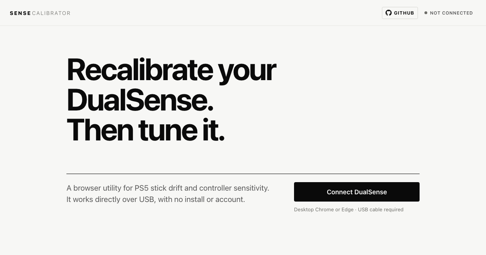

# Sense Calibrator

This browser tool tests and recalibrates the sticks of a standard PS5 DualSense from Chrome or Edge.

It measures stick drift, corrects center and range over USB, compares the controller before and after calibration, finds a practical FPS sensitivity, and tests movement and aim together.

**[Open Sense Calibrator](https://martino-vigiani.github.io/sense-calibrator/)**

You need a desktop computer, Chrome or Edge, a USB data cable and a standard DualSense (`054C:0CE6`). DualSense Edge and DualShock 4 are not supported.

[](https://github.com/martino-vigiani/sense-calibrator/stargazers)   



> Calibration can correct a stable center or range offset. It cannot repair a worn or damaged stick module.

## How to use it

1. Connect the DualSense with a USB data cable.
2. Open the [hosted tool](https://martino-vigiani.github.io/sense-calibrator/) in Chrome or Edge.
3. Select **Connect DualSense** and approve the browser request.
4. Leave both sticks untouched while the drift test runs.
5. Calibrate only if the result shows a correctable offset.
6. Run the same tests again and compare the result.
7. Select **Write to memory** only when you want to keep the calibration.

Calibration stays in controller RAM until step 7. Turning the controller off before that discards the temporary calibration.

## Tools

| Goal | Tool | Result | Changes the controller? |
|---|---|---|---|
| Check for drift | **Drift test** | Resting offset, noise and a result for each stick | No |
| Correct center or range | **Calibration** | Quick, guided and full range procedures | Temporary until **Write to memory** |
| Check the calibration | **Precision test** | Center hold, edge reach and snap back scores | No |
| Find an FPS starting point | **Sensitivity finder** | Look index, ADS ratio and response curve | No |
| Test movement and aim | **Gameplay lab** | Tracking, use of both sticks, movement coverage, USB report timing and browser frame pacing | No |

The sensitivity finder recommends a deadzone only after a real drift measurement. Gameplay lab does not measure complete input latency through a console, game or display.

## Run it locally

Clone or download the repository, then run:

```sh
python3 -m http.server 8000
```

Open `http://localhost:8000` in Chrome or Edge.

WebHID requires a secure context. Opening the page through `file://` does not work. The project is plain HTML, CSS and JavaScript, with no build step or dependencies.

There are no automated hardware tests. A complete check requires a real DualSense connected over USB.

## How the calibration works

The drift test runs for 3 seconds. It discards the first 60 samples and checks a rolling window of 30 samples across all four axes. Only stable samples are used. Resting position uses the median; noise uses the 95th percentile distance from center. The test retries up to twice when there are too few stable samples.

Quick calibration runs up to 4 passes. Each pass sends 12 center samples through HID report `0x82`, commits the result, and measures the remaining offset again. A worse pass is not reported as success. The tool keeps the best measured result and warns when the final state is worse than the starting state.

Guided calibration samples four stick corners. Range calibration uses a 36 bin polar map to check full travel. The precision test measures center hold, edge reach and snap back on a scale from 0 to 100. These checks measure calibration, not player skill.

The sensitivity finder compares right stick tracking at three control speeds. Gameplay lab offers free play and a repeatable 30 second run.

The protocol code is in `js/ds5.js`:

| Report | Purpose |
|---|---|
| `0x82` / `0x83` | Send calibration data and read the response |
| `0x80` / `0x81` | Read device information and manage NVS writing |
| `0x01` | Read raw stick input at about 250 Hz |

For the full technical explanation, read [ARTICLE.md](ARTICLE.md) or the [SubraLabs Lab Paper](https://subralabs.com/lab/sense-calibrator.html).

## Limits

- Only the standard DualSense with USB product ID `054C:0CE6` is supported.
- DualSense Edge and DualShock 4 are not supported.
- Calibration works only over USB. This tool rejects Bluetooth for calibration.
- Chrome and Edge are supported. Safari and Firefox do not provide WebHID.
- Calibration can correct a stable offset. It cannot repair mechanical wear or a damaged potentiometer.

## Telemetry and privacy

The site can send usage events to a server hosted at `subralabs.com`. Sharing is enabled by default, but nothing is uploaded before the first launch notice appears.

Select **Keep sharing** to send the events held in memory. Select **Don't share** to discard them and save the preference. You can change the setting later in the footer or quick calibration dialog. No third party analytics service is used.

Each event contains its type, an ISO 8601 timestamp, board revision, firmware version and `sid`. The `sid` is a random 8 character value created on every page load. It groups events from one visit, is never saved to disk, and changes after a reload.

Measurements can include stick offset, noise, direction, calibration passes, test scores, USB report timing and browser frame pacing. The payload excludes the controller serial number, device identifiers, browser fingerprints and personal information. The receiving server can still see normal network metadata such as an IP address.

A local copy of calibration sessions is stored in `localStorage` under `sense-calib-sessions`, whether or not uploads are enabled.

## Report a controller result

1. Record the board revision, firmware, operating system, browser and USB connection shown by the tool.
2. Run the drift test and precision test before calibration.
3. Calibrate the controller.
4. Repeat the same tests without changing the setup.
5. [Open an issue](https://github.com/martino-vigiani/sense-calibrator/issues/new) with the steps and both results.

Include failures and regressions. Never include a controller serial number or another device identifier.

If the tool helped, [star the repository](https://github.com/martino-vigiani/sense-calibrator). It makes the project easier to find.

## Disclaimer

Sense Calibrator is unofficial and is not affiliated with Sony. Use it at your own risk.

## License

The project is available under the [MIT License](LICENSE). The calibration protocol derives from the MIT licensed [dualshock-tools](https://github.com/dualshock-tools/dualshock-tools.github.io) project by the_al. Its original license is preserved in [THIRD_PARTY_NOTICES.md](THIRD_PARTY_NOTICES.md).
